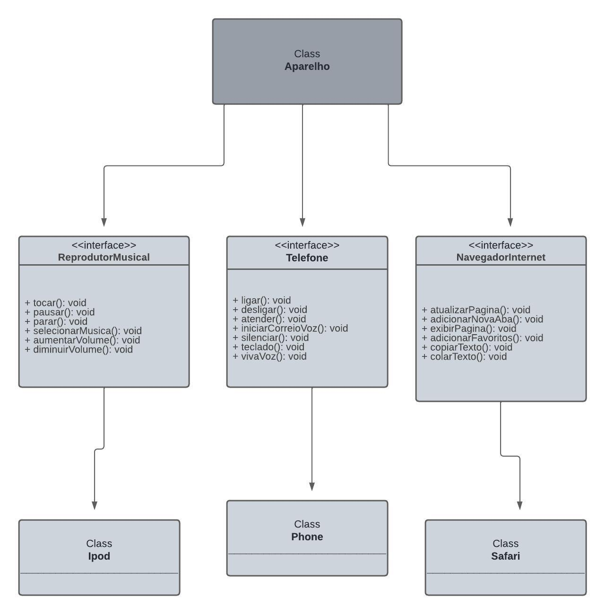

# Desafio P.O.O -  Bootcamp 2024 - Backend Java na plataforma DIO.me.

Este é um diagrama UML que delineia de maneira abrangente a estrutura de classes e interfaces de um sistema. Este sistema abarca a modelagem do iPhone, um dispositivo multifuncional que integra recursos de reprodutor de música, telefone e navegador de internet. O diagrama foi concebido como parte do desafio de projeto do Santander Bootcamp 2024 - Backend Java na plataforma DIO.me.

# Interfaces e Classes

## Reprodutor Musical (ReprodutorMusical)
A interface **ReprodutorMusical** é responsável pela reprodução de áudio, oferecendo funcionalidades como:
+ tocar();
+ pausar();
+ parar();
+ selecionarMusica();
+ aumentarVolume();
+ diminuirVolume();  
A classe Ipod implementa exclusivamente os métodos dessa interface, garantindo a reprodução de áudio conforme especificado.

## Telefone (Telefone)
A interface AparelhoTelefonico é responsável pela funcionalidade de um telefone. Contém métodos como:
+ ligar();
+ desligar();
+ atender();
+ iniciarCorreioVoz();
+ silenciar();
+ teclado();
+ vivaVoz();  
A classe Telefone implementa apenas os métodos da interface AparelhoTelefonico.

## Navegador de Internet (NavegadorInternet)
A interface NavegadorInternet implementa a funcionalidade de um navegador web. Possui métodos como:
+ atualizarPagina();
+ adicionarNovaAba();
+ exibirPagina();
+ adicionarFavoritos();
+ copiarTexto();
+ colarTexto();  
A classe Safari implemnta os métodos da interface NavegadorInternet

# Entidades
O diagrama também apresenta diversas entidades, tais como Ipod, Phone e Safari. Essas entidades representam diferentes dispositivos ou aplicativos que podem fazer uso das interfaces e classes mencionadas anteriormente. Cada uma dessas entidades desempenha um papel específico no contexto do sistema, contribuindo para sua funcionalidade global e oferecendo uma gama de recursos aos usuários.

Este README fornece uma visão geral do diagrama UML e das funcionalidades representadas no sistema. Para mais detalhes sobre a implementação e uso, consulte a documentação e o código-fonte fornecidos.
